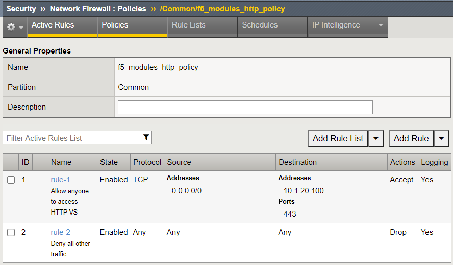
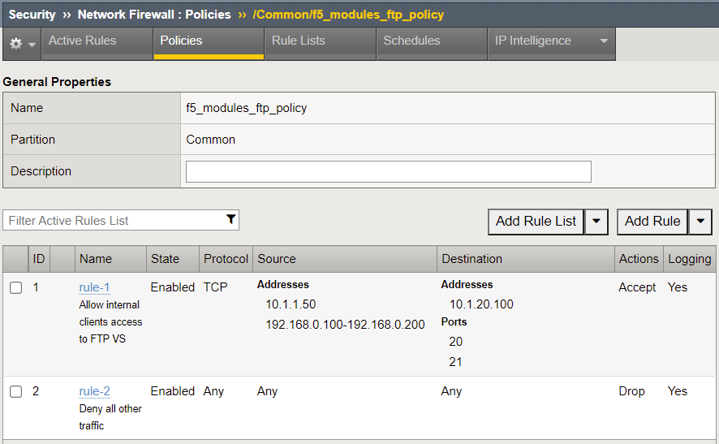
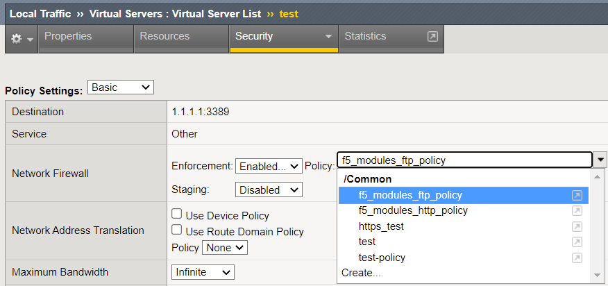

# Configure BIG-IP AFM firewall policies with `f5networks.f5_modules` collection

[f5networks.f5_modules](https://clouddocs.f5.com/products/orchestration/ansible/devel/f5_modules/getting_started.html) uses [iControl REST](https://clouddocs.f5.com/api/icontrol-rest/) APIs to configure AFM firewall policies in an imperative. This means that the firewall policies and rules must be defined in a particular order, e.g. trying to create a firewall rule before a policy will return an error as a rule has to exist within a policy. You can see this order in practice in the [deploy-policy.yaml](../tasks/deploy-policy.yaml) task file.

The firewall policies in this example are represented in YAML in [`f5_modules_policies.yaml`](../inventory/host_vars/bigip01/policies.yaml). The structure is largely based on the input parameters of the [bigip_firewall_policy](https://docs.ansible.com/ansible/latest/collections/f5networks/f5_modules/bigip_firewall_policy_module.html#ansible-collections-f5networks-f5-modules-bigip-firewall-policy-module) and [bigip_firewall_rule](https://docs.ansible.com/ansible/latest/collections/f5networks/f5_modules/bigip_firewall_rule_module.html#ansible-collections-f5networks-f5-modules-bigip-firewall-rule-module) modules.

To deploy the firewall policies, run `ansible-playbook -i inventory/inventory.ini f5-modules-main.yaml`. The following objects will be created on the BIG-IP as defined in the AS3 declaration:

**Firewall policies referencing the address and port lists**

The policies can then be attached to virtual server (outside the scope of this repository) as seen below

Changes to the policies can be done by updating the inventory, and rerunning the Ansible playbook.

To remove the firewall policies, run `ansible-playbook -i inventory/inventory.ini f5-modules-clean-up.yaml`
