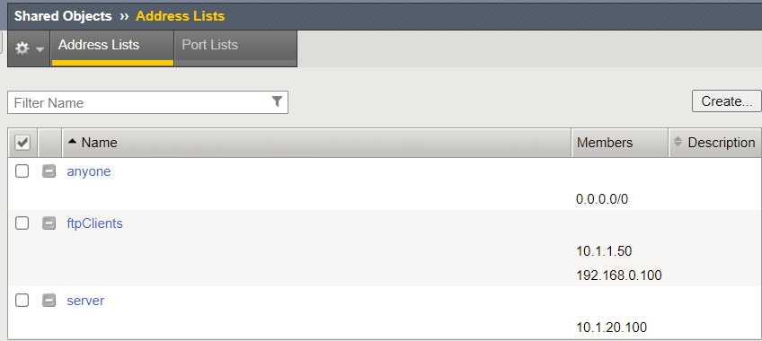
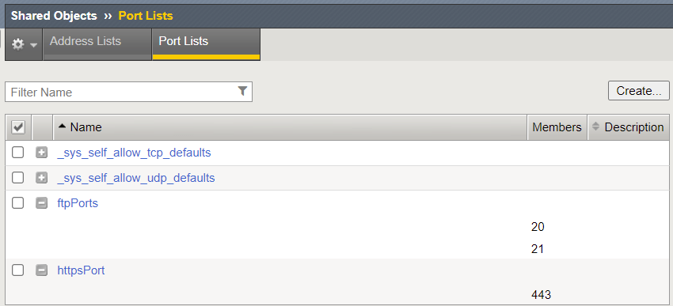
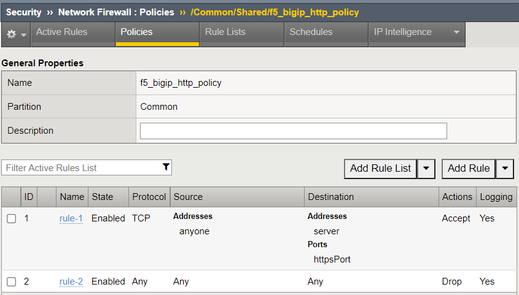
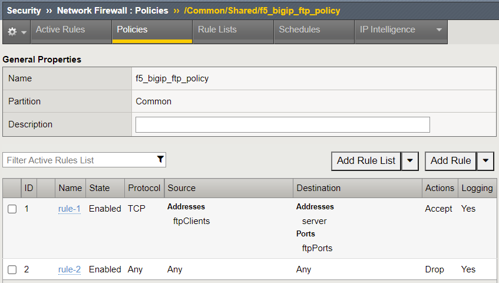
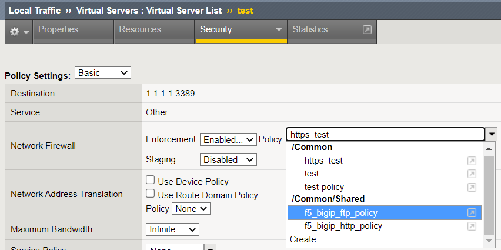

# Configure BIG-IP AFM firewall policies with `f5networks.f5_bigip` collection

[f5networks.f5_bigip](https://clouddocs.f5.com/products/orchestration/ansible/devel/f5_bigip/modules_2_0/module_index.html) uses [Application Services 3](https://clouddocs.f5.com/products/extensions/f5-appsvcs-extension/latest/) extension to enable a declarative approach to configuring AFM firewall policies. This means that the firewall policies and rules can be defined in any order within the declaration, and AS3 will translate the declaration to the correct order of operation on the BIG-IP.

The firewall policies in this example are represented in YAML in [`policies.yaml`](inventory/host_vars/bigip01/policies.yaml). The structure largely follows the AS3 schema for firewall objects, where address lists and port lists are separate objects referenced within [firewall rules](https://clouddocs.f5.com/products/extensions/f5-appsvcs-extension/latest/refguide/schema-reference.html#firewall-rule), simplifying the Jinja2 template [`firewall_policy.json.j2`](./templates/firewall_policy.json.j2) used to generate the AS3 request body.

To deploy the firewall policies, run `ansible-playbook -i inventory/inventory.ini main.yaml`. The following objects will be created on the BIG-IP as defined in the AS3 declaration:

**Address lists**

**Port lists**

**Firewall policies referencing the address and port lists**

The policies can then be attached to virtual server (outside the scope of this repository) as seen below

Changes to the policies can be done by updating the inventory, and rerunning the Ansible playbook.

To remove the firewall policies, run `ansible-playbook -i inventory/inventory.ini clean-up.yaml`
